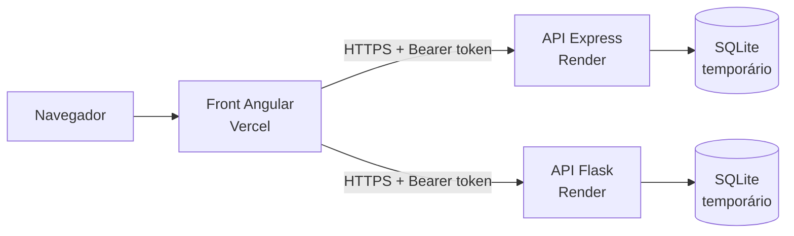
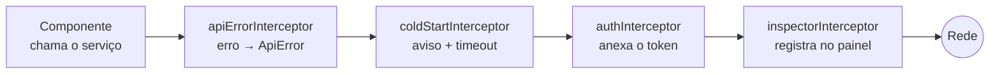

# Task App (Angular) — Anotações de estudo

> **Data:** 2026-10-09 · **Stack:** Angular 22 (standalone, signals, sem Zone.js) · TypeScript 6 · RxJS 7 · Reactive
> Forms · Vitest · angular-eslint + Prettier · GitHub Actions · Vercel (front) · Render (APIs)

---

## 1. Visão geral

Front-end em **Angular** que consome as **duas versões da mesma Task API**: a de Node.js + Express
(`task-api-express`) e a de Python + Flask (`task-api-flask`). É uma vitrine de portfólio: em vez de ser "mais um
to-do list", o objetivo é **mostrar** duas coisas que normalmente ficam invisíveis:

1. as duas APIs têm **o mesmo contrato** (mesmos endpoints, mesmos códigos de erro, mesmo formato de resposta);
2. o **tratamento de erros** delas: toda falha volta num JSON padronizado, com `code`, `details` e `requestId`.

Para isso, o app tem um **seletor de API** no topo, um **painel "por baixo dos panos"** que mostra cada requisição e
a resposta crua, e uma tela **"Testar erros"** que manda requisições inválidas de propósito para as duas APIs ao
mesmo tempo e compara as respostas com o contrato.

Em produção: https://task-app-angular-taupe.vercel.app (front na Vercel, APIs no plano gratuito do Render).

---

## 2. Arquitetura



O front é uma **SPA** (Single Page Application): a Vercel só entrega arquivos estáticos (HTML, JS, CSS), e todo o
resto acontece no navegador, que conversa direto com as APIs. Não existe um "backend do front".

### O caminho de uma requisição (a cadeia de interceptors)

Toda chamada HTTP passa por quatro **interceptors**, em ordem. O primeiro da lista é o mais externo: vê a requisição
primeiro na ida e a resposta por último na volta.



| Interceptor            | O que faz                                                                                                                                                         |
| ---------------------- | ----------------------------------------------------------------------------------------------------------------------------------------------------------------- |
| `apiErrorInterceptor`  | Converte qualquer falha em `ApiError` (`status`, `code`, `message`, `details`, `requestId`, `retryAfter`). Os componentes tratam **um formato só**.               |
| `coldStartInterceptor` | Mostra "Acordando a API…" se a resposta passa de 3 s e dá até 90 s de espera quando a API pode estar dormindo (20 s se respondeu há pouco). Estourou → `TIMEOUT`. |
| `authInterceptor`      | Anexa o token **da API de destino** (descoberta pela URL). Se a API recusar o token que **ele** anexou, encerra a sessão e leva ao login.                         |
| `inspectorInterceptor` | O mais perto da rede: registra a requisição já com o token e a resposta antes de virar `ApiError`, e lê os cabeçalhos de rate limit. É o que o painel mostra.     |

Por que o inspetor fica **por último**? Se ficasse antes do `authInterceptor`, a requisição registrada ainda não
teria o cabeçalho `Authorization`. E se ficasse antes do `apiErrorInterceptor`, ele veria o erro já convertido, e
não a resposta crua da API.

### Estado (signals) por API

| Peça             | O que guarda                                                           |
| ---------------- | ---------------------------------------------------------------------- |
| `ApiSelector`    | Qual API está escolhida e como montar a URL (`api.url('/tasks')`)      |
| `SessionStore`   | **Uma sessão por API** (token + usuário), salva no `localStorage`      |
| `InspectorStore` | Histórico das últimas 30 requisições do painel                         |
| `ApiStatusStore` | Se cada API respondeu há pouco (está acordada) e quais estão demorando |
| `RateLimitStore` | Último limite de requisições conhecido de cada API                     |

### Estrutura de pastas

```
src/
├── environments/           # URLs das APIs: localhost no `ng serve`, Render no build de produção
└── app/
    ├── app.ts / app.html   # "casca": cabeçalho com o seletor, avisos, <router-outlet> e o painel
    ├── app.config.ts       # providers: router, HttpClient e a ordem dos interceptors
    ├── app.routes.ts       # rotas com lazy loading e guards
    ├── core/               # contrato, estado e HTTP (nada de tela aqui)
    │   ├── api.models.ts   # tipos do contrato (Task, erros, paginação)
    │   ├── api-error.ts    # ApiError e a normalização de erros
    │   ├── interceptors.ts # os quatro interceptors
    │   ├── rate-limit.ts   # leitura dos cabeçalhos RateLimit / RateLimit-Policy / Retry-After
    │   └── *.store.ts / *.service.ts
    ├── features/           # uma pasta por tela
    │   ├── auth/           # login e cadastro (o mesmo componente, modo vindo da rota)
    │   ├── tasks/          # lista (filtros, paginação) e formulário (criar/editar)
    │   └── error-lab/      # "Testar erros": cenários e tabela comparativa
    └── shared/             # alerta de erro, painel, medidor de rate limit, helpers de formulário
```

---

## 3. Fases e etapas

### Fase 1 — Criação do projeto e qualidade (2026-10-08)

- **Objetivo:** ter um projeto Angular moderno, com o mesmo padrão de qualidade das APIs.
- **O que foi feito:**
  1. `ng new` com Angular 22: componentes standalone, sem SSR, CSS puro, sem criar repositório Git (o usuário faz os
     próprios commits).
  2. `ng add angular-eslint` (lint de TypeScript **e** de templates HTML) + `eslint-config-prettier` (desliga regras
     de estilo que brigariam com o Prettier).
  3. Prettier com a mesma configuração das APIs (`printWidth: 120`, aspas simples), `.gitattributes` com `eol=lf`,
     `environments` com `fileReplacements` no `angular.json`.
- **Por quê:** o Angular 22 já vem **sem Zone.js** (zoneless) e com **Vitest** como runner de testes, então não foi
  preciso configurar nada disso à mão. O padrão de qualidade (lint, formatação, CI) foi copiado das APIs para o
  portfólio ficar consistente.

### Fase 2 — O núcleo: contrato, erros, sessão e interceptors

- **Objetivo:** concentrar num lugar só tudo o que é "conversar com a API".
- **O que foi feito:**
  - `api.models.ts` com os tipos do contrato, escritos a partir do README das APIs.
  - `ApiError` + `toApiError`: transforma a resposta de erro do `HttpClient` no formato do contrato. Casos especiais:
    `status 0` (API fora do ar ou CORS) vira `NETWORK_ERROR`; resposta fora do formato vira `UNEXPECTED_RESPONSE`.
  - `SessionStore` com **uma sessão por API**, porque cada API tem o seu banco e recusa tokens da outra (claim `iss`
    do JWT).
  - Os interceptors (veja a seção 2) e os `HttpContextToken`s: `ATTACH_SESSION_TOKEN` (não anexar o token) e
    `REQUEST_LABEL` (nome amigável no painel).
- **Por quê:** é exatamente o ponto em que o Angular brilha. Sem interceptor, cada serviço teria que lembrar de
  anexar o token, tratar erro e registrar no painel. Com ele, os serviços ficam com uma linha cada
  (`this.http.get(...)`).
- **Detalhe importante:** o `authInterceptor` só encerra a sessão quando a API recusa o token que **ele mesmo**
  anexou. Assim, o "Testar erros" pode mandar tokens adulterados de propósito sem deslogar o usuário.

### Fase 3 — As telas

- **Login/cadastro:** um componente só, com o modo (`login` | `register`) vindo do `data` da rota. **Reactive Forms**
  com as **mesmas regras** do backend (nome 2–100, senha ≥ 8...). Um checkbox **desliga a validação do front** para
  ver a API recusando; os itens de `details` do erro caem embaixo do campo certo (`applyServerErrors`).
- **Lista de tarefas:** `rxResource` (recarrega sozinho quando filtros, página ou API mudam) e `linkedSignal` para a
  página **voltar a 1** quando um filtro muda.
- **Formulário de tarefa:** o `:id` da rota chega como `input()` (`withComponentInputBinding`). O id vai para a API
  como veio, de propósito: em `/tarefas/abc`, quem recusa é a API, e o erro aparece na tela.
- **Por quê:** telas pequenas de propósito; o foco é o comportamento HTTP, não a interface.

### Fase 4 — "Testar erros" nas duas APIs lado a lado

- **Objetivo:** provar o contrato de forma visual.
- **O que foi feito:** 14 cenários (JSON malformado, Content-Type errado, token adulterado, token da outra API,
  campos inválidos, rota inexistente, método não permitido...). Cada um roda **nas duas APIs ao mesmo tempo**, e a
  tabela compara `status` e `code` com o esperado. Resultado local: **28 de 28** respostas conforme o contrato.
- **Por quê:** antes de escrever os cenários, cada um foi conferido com `curl` nas duas APIs (ex.: o 405 vem antes ou
  depois da autenticação?), para o teste não esperar algo errado.

### Fase 5 — Testes, CI e Dependabot

- Testes unitários com **Vitest** e `HttpTestingController` (simula o backend sem rede): normalização de erros,
  cada interceptor, sessão por API, helpers de formulário, cold start (com `vi.useFakeTimers()`), rate limit.
- **CI** no GitHub Actions com três jobs: lint (ESLint + Prettier + actionlint), testes e build de produção (que
  falha se passar do orçamento de tamanho do `angular.json`).
- **Dependabot** com os pacotes do Angular **agrupados** (eles precisam subir juntos, na mesma versão) e as versões
  major ignoradas, porque major do Angular pede `ng update`, que roda migrações de código.

### Fase 6 — Preparar para as APIs no Render (cold start e banco temporário)

- **Objetivo:** lidar com as limitações do plano gratuito do Render.
- **O que foi feito:**
  - `environment.ts` apontando para o Render, com `demo: true` para mostrar avisos de demonstração.
  - `coldStartInterceptor` + `ApiStatusStore`: aviso "Acordando a API…" depois de 3 s e espera maior quando a API não
    respondeu nos últimos 14 min (ela dorme com 15 min sem uso).
  - Ao escolher uma API, o app chama `/health` **uma vez** para ela ir acordando enquanto o usuário digita o login.
  - Avisos de "banco temporário" na tela de login (a conta pode ter sumido num reinício).
- **Por quê (alternativa descartada):** serviços que "pingam" a API a cada poucos minutos manteriam ela acordada, mas
  gastariam as 750 h grátis por mês, que são divididas entre as duas APIs.

### Fase 7 — Deploy na Vercel

- **Objetivo:** publicar o front.
- **O que foi feito:** `vercel.json` com build, pasta de saída, **rewrite** das rotas para o `index.html` e cache
  longo (`immutable`) para JS/CSS.
- **Por quê Vercel:** o usuário já conhecia; o front é estático, o plano gratuito basta, e cada PR ganha uma URL de
  preview. Alternativas consideradas: Render Static Site, Cloudflare Pages, GitHub Pages (descartado por exigir
  `--base-href` e um truque com `404.html`).
- **Ajuste depois do primeiro deploy:** o rewrite pegava **tudo**, então um `.js` inexistente voltava como HTML
  (status 200). O rewrite passou a valer só para caminhos **sem extensão** (veja a seção 7).

### Fase 8 — CORS com lista de origens (mudança nas APIs)

- **Objetivo:** trocar o `CORS_ORIGIN=*` pelo domínio do front **sem bloquear as URLs de preview** da Vercel (uma por
  deploy e por branch).
- **O que foi feito nas duas APIs:** `CORS_ORIGIN` passou a aceitar `*` **ou** uma lista separada por vírgulas, em que
  cada item pode ter um `*` no lugar de um trecho do host
  (`https://task-app-angular-*-eduardolovos-projects.vercel.app`). O `*` casa letras, números e hífen, **nunca um
  ponto**, então não "escapa" para o domínio de outra pessoa. Valor inválido impede a API de subir.
- **Ordem dos deploys:** primeiro o código das APIs, depois o `render.yaml`. Ao contrário, o Express antigo devolveria
  a string inteira, com vírgula, como origem, e o front pararia de funcionar.
- **Verificação:** em produção, as duas liberam o front e os previews, e bloqueiam domínios de fora e `localhost`.

### Fase 9 — Cabeçalhos de rate limit expostos e padronizados (mudança nas APIs)

- **Objetivo:** permitir que o front leia quantas requisições restam.
- **O problema:** o navegador **esconde** de um JavaScript de outra origem todo cabeçalho que não esteja em
  `Access-Control-Expose-Headers`. E, ao investigar, apareceram **três diferenças** entre as APIs:

  |                              | Express (antes)           | Flask (antes)     |
  | ---------------------------- | ------------------------- | ----------------- |
  | Nome da política             | `"100-in-15min"`          | `"100-in-900sec"` |
  | Rotas `/auth` (dois limites) | listava as duas políticas | só a última       |
  | `pk` (identifica o cliente)  | tinha                     | não tinha         |

- **O que foi feito:** os três cabeçalhos expostos no CORS; nome fixado em segundos nas duas; o Flask passou a listar
  todas as políticas e a gerar o `pk` com o **mesmo cálculo** do Express (sha256 do IP). Os testes das duas APIs usam
  o mesmo valor esperado de `pk`, e em produção as duas devolveram até o mesmo `pk`.

### Fase 10 — Limite de requisições no painel (2026-10-09)

- **O que foi feito:** parser dos cabeçalhos `RateLimit` e `RateLimit-Policy` (formato draft-8 do IETF), o
  `RateLimitStore` (último valor por API) e o componente `RateLimitMeter`. O painel mostra as duas APIs lado a lado
  ("99 de 100 restantes · renova às 10:00"), cada requisição mostra o próprio limite, e um 429 diz "Tente de novo
  em 10 min" (cabeçalho `Retry-After`).
- **Testado em produção:** além do quadro, deu para ver o **cold start ao vivo** (Express levou 13 s para acordar, Flask
  22 s, com o aviso na tela).

---

## 4. Ferramentas e tecnologias

| Ferramenta                    | Para que serve (em geral)                                   | Como foi usada aqui                                              | Por que foi escolhida                                                        |
| ----------------------------- | ----------------------------------------------------------- | ---------------------------------------------------------------- | ---------------------------------------------------------------------------- |
| **Angular 22**                | Framework completo para SPAs (rotas, HTTP, formulários, DI) | Todo o front                                                     | Stack nova no portfólio (que já tinha React/Next.js) e encaixe com o projeto |
| **Signals**                   | Estado reativo do Angular (`signal`, `computed`, `effect`)  | Sessões, painel, filtros, status das APIs                        | Padrão atual do Angular; dispensa o Zone.js                                  |
| **RxJS**                      | Programação com fluxos assíncronos (Observables)            | `HttpClient`, interceptors (`catchError`, `timeout`, `finalize`) | É o que o `HttpClient` usa                                                   |
| **HttpClient + interceptors** | Cliente HTTP com "middlewares" do lado do front             | Token, erros, cold start e painel em um lugar só                 | Era um dos motivos para escolher Angular                                     |
| **Reactive Forms**            | Formulários definidos no TypeScript, com validadores        | Login, cadastro e tarefa, com as regras do backend               | Permite ligar/desligar validação e aplicar os erros da API nos campos        |
| **TypeScript 6**              | JavaScript com tipos                                        | Tipos do contrato (`Task`, `ErrorBody`...)                       | Padrão do Angular                                                            |
| **Vitest**                    | Runner de testes rápido                                     | 32 testes unitários (`ng test`)                                  | Padrão do Angular 22                                                         |
| **angular-eslint**            | ESLint com regras de Angular e de templates                 | `ng lint` (inclui acessibilidade dos templates)                  | Mesmo padrão de lint das APIs                                                |
| **Prettier**                  | Formatador automático                                       | Código, HTML, CSS, Markdown                                      | Mesmo padrão das APIs                                                        |
| **GitHub Actions**            | CI                                                          | Lint, testes e build a cada push/PR                              | Mesmo padrão das APIs                                                        |
| **Dependabot**                | PRs automáticos de atualização                              | npm (Angular agrupado) e actions                                 | Mesmo padrão das APIs                                                        |
| **Vercel**                    | Hospedagem de sites estáticos/SPAs                          | Produção + previews por PR                                       | O usuário já conhecia; gratuito; previews                                    |
| **Render**                    | Hospedagem de serviços (as APIs)                            | Express e Flask em Docker, plano free                            | Decidido nos repositórios das APIs                                           |

### Explicando as principais

**Angular** é um framework "com bateria inclusa": rotas, HTTP, formulários e injeção de dependências já vêm prontos e
seguem um padrão. Em React, cada uma dessas peças costuma ser uma biblioteca diferente escolhida pelo time.

**Signals** são "caixinhas" de valor que avisam quem depende delas quando mudam. `signal()` guarda um valor,
`computed()` deriva outro (ex.: `isLoggedIn = computed(() => current() !== null)`) e `effect()` roda um efeito
colateral (ex.: navegar para o login quando a sessão acaba). Como o Angular sabe exatamente o que mudou, ele não
precisa mais do **Zone.js** para "adivinhar" quando redesenhar a tela.

**Interceptors** são funções que ficam entre o código e a rede, como os middlewares do Express, só que no front. Cada
um recebe a requisição e o `next` (o próximo da cadeia), e pode mudar a requisição na ida ou a resposta na volta.

**Reactive Forms** definem o formulário no TypeScript (`new FormGroup({ title: new FormControl('') })`). Como os
validadores são código, dá para trocá-los em tempo de execução (o checkbox "validar também no front") e marcar um campo
com um erro vindo da API (`control.setErrors({ server: 'Título é obrigatório' })`).

**Vitest + HttpTestingController**: o `HttpTestingController` intercepta as requisições do `HttpClient` nos testes; o
teste decide a resposta (`.flush(corpo, { status: 401 })`) e confere o que foi enviado. Dá para testar interceptors
sem nenhuma API rodando.

---

## 5. Comandos usados

```bash
# Cria o projeto (Angular 22, CSS, rotas, sem SSR, sem Git)
npx @angular/cli@22 new task-app-angular --style=css --routing --ssr=false --skip-git

# Adiciona ESLint com regras de Angular
npx ng add angular-eslint

# Instala as dependências exatamente como no package-lock.json (usado no CI e na Vercel)
npm ci

# Sobe o front em http://localhost:4200 (usa environment.development.ts → APIs locais)
npm start

# Sobe as duas APIs localmente com Docker (no repositório irmão)
cd ../task-api-compose && docker compose up --build -d

# Testes unitários uma vez / em modo observação
npm test
npm run test:watch

# Lint (TypeScript + templates) e formatação
npm run lint
npm run format          # format:check só verifica

# Build de produção em dist/task-app-angular/browser (usa environment.ts → Render)
npm run build

# Roda o build de produção localmente (precisa das APIs locais: o CORS do Render bloqueia localhost)
npx ng serve --configuration production

# Confere a pré-checagem de CORS de uma API (o que o navegador faz antes de um POST)
curl -i -X OPTIONS -H "Origin: https://task-app-angular-taupe.vercel.app" \
  -H "Access-Control-Request-Method: POST" https://task-api-flask-1ozq.onrender.com/tasks

# Desfaz o último commit (ainda sem push) mantendo as mudanças nos arquivos
git reset --soft HEAD~1
```

---

## 6. Conceitos-chave

**SPA e rewrite.** Numa SPA, rotas como `/tarefas` não existem como arquivo no servidor: quem as resolve é o router do
Angular, no navegador. Por isso a hospedagem precisa devolver o `index.html` para essas rotas (o **rewrite** do
`vercel.json`). Mas só para elas: um `.js` que não existe deve dar 404, e não o HTML.

**CORS.** O navegador bloqueia um JavaScript de `vercel.app` de ler respostas de `onrender.com`, a menos que a API
autorize com `Access-Control-Allow-Origin`. Para requisições "não simples" (com `Authorization` ou JSON), o navegador
manda antes um **preflight** (`OPTIONS`). E mesmo com a origem liberada, o JS só lê os cabeçalhos listados em
`Access-Control-Expose-Headers`. Foi por isso que o `RateLimit` chegava como `null` no front até a Fase 9. Quando a
resposta muda conforme a origem, a API manda `Vary: Origin`, para caches não misturarem respostas.

**JWT com emissor (`iss`).** Cada API assina o token dizendo quem o emitiu e recusa tokens de outro emissor. Por isso o
front guarda uma sessão por API, e o cenário "token da outra API" do laboratório dá `INVALID_TOKEN`.

**Cold start.** No plano gratuito, o serviço dorme sem uso e a primeira requisição espera ele acordar. O front não
consegue evitar isso, mas consegue **explicar** (aviso), **esperar mais** (timeout maior) e **adiantar** (chamar
`/health` assim que o usuário escolhe a API).

**Rate limit (draft-8 do IETF).** `RateLimit: "100-in-900sec"; r=97; t=894` significa: na política de 100 requisições
a cada 900 s, restam 97, e a janela reinicia em 894 s. `RateLimit-Policy` descreve a política (`q` = limite, `w` =
janela, `pk` = chave do cliente). No 429, `Retry-After` diz em quantos segundos tentar de novo.

**Cache com hash no nome.** O build gera `main-Y45M5V6M.js`; se o código muda, o nome muda. Então dá para mandar o
navegador guardar esses arquivos "para sempre" (`max-age=31536000, immutable`), enquanto o `index.html`, que aponta
para os nomes novos, é sempre revalidado.

**Environments.** O `angular.json` troca `environment.ts` por `environment.development.ts` no `ng serve`
(`fileReplacements`). Assim o mesmo código usa as APIs locais em desenvolvimento e as do Render em produção.

**Lazy loading.** As rotas usam `loadComponent: () => import(...)`: o código de cada tela vira um arquivo separado,
baixado só quando o usuário entra nela. Dá para ver isso na saída do build ("Lazy chunk files").

**OnPush e zoneless.** Os componentes só são redesenhados quando um signal que eles leem muda, um `input()` muda ou
acontece um evento na tela. Por isso o estado fica em signals, e não em variáveis comuns.

---

## 7. Problemas encontrados e soluções

| Problema                                                          | Causa                                                                                                                                                                           | Solução                                                                                                                             |
| ----------------------------------------------------------------- | ------------------------------------------------------------------------------------------------------------------------------------------------------------------------------- | ----------------------------------------------------------------------------------------------------------------------------------- |
| `.js` inexistente na Vercel respondia **200 com HTML**            | O rewrite `/(.*) → /index.html` pegava qualquer caminho. Depois de um deploy, uma aba antiga pedindo um chunk que já não existe receberia HTML e quebraria com um erro confuso. | Rewrite só para caminhos **sem extensão**: `"source": "/((?!.*\\.).*)"`. Rotas continuam abrindo o app; arquivo inexistente dá 404. |
| Front não conseguia ler `RateLimit` (`null`)                      | O navegador esconde cabeçalhos fora do `Access-Control-Expose-Headers`.                                                                                                         | PR nas duas APIs expondo `RateLimit`, `RateLimit-Policy` e `Retry-After`.                                                           |
| Cabeçalhos de rate limit diferentes entre as APIs                 | Express (biblioteca) usava `append` e nome em minutos; Flask (código próprio) sobrescrevia e não tinha `pk`.                                                                    | Nome fixado em segundos nas duas, Flask passou a listar todas as políticas e a calcular o `pk` igual.                               |
| CORS: um domínio só bloquearia os previews                        | A Vercel cria uma URL por deploy e por branch.                                                                                                                                  | `CORS_ORIGIN` com lista e curinga que não casa ponto (Fase 8).                                                                      |
| Preview da Vercel redirecionava para o login                      | **Deployment Protection**: previews só abrem para quem está logado na conta.                                                                                                    | Comportamento desejado; o CORS do preview foi conferido com `curl`.                                                                 |
| Depois do CORS restrito, `localhost` não acessa as APIs do Render | `localhost` não está na lista (e não deve estar).                                                                                                                               | Para testar o build de produção localmente, usar as APIs locais.                                                                    |
| flask-cors poderia tratar `task-app.vercel.app` como regex        | Ele "adivinha" se uma string é regex pelos caracteres; o `.` casa qualquer caractere numa regex.                                                                                | Passar **todas** as origens já compiladas como regex ancorada (`re.escape` + `^...\Z`).                                             |
| `/health` do Express deu 502 logo após o merge                    | O Render ainda estava trocando a versão (deploy) / acordando.                                                                                                                   | Esperar e testar de novo: depois de ~30 s, 200.                                                                                     |
| Limite global 85 no Express e 87 no Flask no mesmo teste          | Suspeita de requisição contada só num lado.                                                                                                                                     | Medido tipo por tipo: todas contam igual e o preflight não conta. A diferença veio de `curl` manuais só no Express.                 |
| Um commit "docs" levou arquivos de uma funcionalidade pela metade | O commit foi feito enquanto o código ainda estava sendo escrito, e incluiu tudo o que estava modificado.                                                                        | Como não tinha push: `git reset --soft HEAD~1` e um commit único com a funcionalidade completa.                                     |
| Porta 3000 "já em uso" ao subir a API à mão                       | O Docker Desktop terminou de iniciar e subiu os containers no mesmo momento.                                                                                                    | Usar os containers e parar a cópia manual, para não haver dois serviços na mesma porta.                                             |
| Comandos com crases quebravam no terminal                         | No Git Bash, crases dentro de aspas duplas viram substituição de comando (`` `cmd` ``).                                                                                         | Editar arquivos com o editor (ou heredoc com `'EOF'`) em vez de `node -e "..."` com template strings.                               |

---

## 8. O que aprendi

- **Interceptors** deixam cada serviço com uma linha e concentram token, erros, timeout e logging num lugar só. A
  **ordem** importa: quem precisa ver a requisição "final" (o inspetor) fica perto da rede.
- Normalizar erros num tipo só (`ApiError`) simplifica todos os componentes, inclusive para falhas que nem vieram da
  API (rede, CORS, timeout).
- **Validar no front e no back com as mesmas regras**, e saber mostrar os `details` da API no campo certo, dá a melhor
  experiência e protege de verdade (o front é só conveniência; quem garante é a API).
- Signals + `rxResource` + `linkedSignal` resolvem "recarregar quando algo muda" e "voltar para a página 1" sem
  `subscribe` manual.
- **CORS** é sobre o que o **navegador** deixa o JavaScript ler. Liberar a origem não basta: cabeçalhos customizados
  precisam ser expostos.
- Um front que mostra o tráfego HTTP **revela diferenças** entre implementações que os testes de cada uma não pegavam
  (os cabeçalhos de rate limit).
- Mudança de configuração que depende de código novo tem **ordem de deploy**: código primeiro, configuração depois.
- Plano gratuito tem limitações (cold start, banco temporário) que o front deve **explicar**, não esconder.
- Antes de concluir que algo está errado, **medir**: a diferença 85 × 87 parecia bug e era ruído do próprio teste.

---

## 9. Próximos passos / para estudar mais

- **Testes end-to-end** (Playwright) cobrindo o fluxo real: cadastro → criar tarefa → "Testar erros".
- **Diferença conhecida:** com IPv6, o Express limita por faixa /56 e o Flask por endereço. Alinhar exigiria mudar o
  comportamento do rate limit numa das APIs.
- Levar os cenários do "Testar erros" para o **teste de contrato** do `task-api-compose`, incluindo CORS e cabeçalhos
  de rate limit.
- Filtros da lista na **query string** da URL (dá para compartilhar e voltar com o botão do navegador).
- Aprofundar:
  - Signals: https://angular.dev/guide/signals
  - `rxResource` / `resource`: https://angular.dev/guide/signals/resource
  - Interceptors: https://angular.dev/guide/http/interceptors
  - Reactive Forms: https://angular.dev/guide/forms/reactive-forms
  - Testes de HTTP: https://angular.dev/guide/http/testing
  - CORS (MDN): https://developer.mozilla.org/pt-BR/docs/Web/HTTP/CORS
  - Cabeçalhos de rate limit (IETF): https://datatracker.ietf.org/doc/draft-ietf-httpapi-ratelimit-headers/
  - Rewrites na Vercel: https://vercel.com/docs/project-configuration#rewrites
